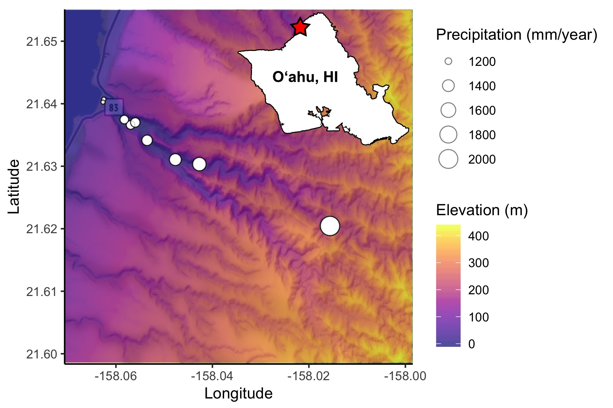

## Overview  
Plant part and environmental context shape symbiotic microbial compositions, yet the interaction of these two variables are seldom considered. We analyzed epiphytic microbes from nine *Hibiscus tiliaceus* (Hawaiian: *hau*) trees across a steep environmental gradient within a single Hawaiian watershed in Waimea Valley on the north shore of O‘ahu, Hawai‘i. At each location we sampled *nine microhabitats*: leaves, petioles, axils, stems, roots, and litter from the plant, as well as surrounding air and soil.   

The composition of microbial communities is driven primarily by microhabitat (i.e., above vs. below ground communities), this variable predicted more than twice the compositional variance in bacteria compared to fungi. Fungal community compositions, in contrast, were more responsive to gradient dynamics than bacteria, and there were differences between spatial dynamics of fungal communities associated with different microhabitats that correlate with distribution patterns and range size. Within plants, microbes were compositionally nested with aboveground communities containing a subset of diversity found belowground. Our findings suggest potential differences in the underlying mechanisms shaping communities of fungi and bacteria associated with plants, and indicate an interaction between assembly mechanisms working simultaneously on different spatial scales.  

```{r global options, results="hide", warning=FALSE, message=FALSE}
if (!require('knitr')) install.packages('knitr'); library('knitr')
knitr::opts_chunk$set(warning=FALSE, message=FALSE, fig.align='center')

# Load in packages
if (!require("pacman")) install.packages("pacman"); library(pacman) # for rapid install if not in library
if(!requireNamespace("BiocManager", quietly = TRUE))
	install.packages("BiocManager")	#Load packages from Bioconductor

pacman::p_load('FedData', 'latticeExtra', 'scales', 'viridis', 'ggmap', 'phyloseq', 'raster', 'rgdal', 'RColorBrewer', 'ggplot2', 'vegan', 'ggplot2', 'phyloseq', 'bipartite', 'plotrix', 'viridis', 'lattice', 'fossil', 'plyr', 'devtools', 'ggpubr', 'gridExtra', 'cowplot')

devtools::install_bitbucket("graumannlabtools/multipanelfigure")
```
  
#### Site Map  
The site where the study was conducted: Waimea Valley on the north shore of O‘ahu, Hawai‘i.
```{r, SiteMap_Script_AustinGreene, results="hide", fig.show='hide'}
# Code by Austin Greene
# Edited by Chris Wall

# Purpose: Generate a map of Waimea Valley, Oahu with elevation data, 
# and site locations which are scaled the mean-annual precipitation 

# Load in physeq object
physeq1=readRDS("data/physeq1.gz")

# Getting base map via Stamen of location within bounding box. 
# Using Stamen maps which do not require a Google API key
map3 <- get_map(location = c(left = -158.070631, bottom = 21.598356, right = -157.998464, top = 21.655101), zoom=13, source="stamen", maptype = c("terrain-background"))
Waimea_map_3 <- ggmap(map3) # Turn into ggmap graphical object

# Generating extents of map to pull elevation
bb <- attr(map3, "bb") # Mapp attribute object, from which we extract map extents 
extentB <- polygon_from_extent(raster::extent(bb$ll.lon, bb$ur.lon, bb$ll.lat, bb$ur.lat),
                               proj4string = "+proj=longlat +ellps=GRS80 +datum=NAD83 +no_defs")

# Confirm bounding box for our elevation data
# ggmap(map3) + geom_polygon(data=extentB, fill=NA, aes(x=long,y=lat), color="red", size=3)

# Download elevation data tiles
elev_waimea <- get_ned(template = extentB, label = "ned_waimea", res="1", force.redo = F)

# Make df of elevation data with lat and long included
elev_raster_df <- raster::as.data.frame(elev_waimea, xy=TRUE) #xy True 

# Make a dataframe of geographic location and mean annual precip at each site (from existing metadata)
geo_p=cbind(sample_data(physeq1)$Long, sample_data(physeq1)$Lat, sample_data(physeq1)$rain, sample_data(physeq1)$FieldSite)
geo3 = data.frame(geo_p) #we convert it to a dataframe
colnames(geo3)=c("Long", "Lat","Rain", "Site") # Repair column names
geo3 <- subset(geo3, Site != 9) # Remove Site 9 
geo3$Site <- factor(geo3$Site) # Convert sites to factors, not critical

# Plot elevational data and site locations scaled by precipitation on top of existing ggmap of Waimea Valley
Waimea_map_6_sizescaled <- Waimea_map_3 + # Existing map
  geom_raster(data = elev_raster_df, aes(x=x, y=y, fill=elev_raster_df$ned_waimea_NED_1)) + # Raster elevation data
  geom_point(data = geo3, aes(x=Long, y=Lat, size=Rain), fill="white", color="black", pch=21, alpha=0.5) + # Points for sites, scaled by mean-annual precipitation
  coord_cartesian() +  # Set to cartesian coordinates
  scale_fill_viridis(option = "plasma", alpha = 0.7) + # Set fill colors to be colorblind-friendly
  coord_fixed(1.3) + # Aspect ratio of cartesian coordinates is 1.3
  labs(x="Longitude", y="Latitude", size="Precipitation (mm/year)", fill="Elevation (m)") + # Labels
  theme_classic() # Classic minimalist theme

Waimea_map_6_sizescaled # Print the plot
```
  
  
<center>  
  
{ width=60%}

</center>  
  
 
  
#### Distance decay: Bacteria and fungi  
Inspect the bacterial and fungal communities using rarified and square-root transformed counts un Bray-Curtis dissimilarity matrix. There is a significant correlation between the 2 communities, with each showing similar patterns of dissimilarity and similarity within individual samples.  
  
```{r, fungibacteria_mantel, results="hide", fig.dim=c(6,4), fig.align="center", fig.cap="Figure. Bacterial and Fungal community mantel tests."}
# Code by Anthony
# modifed by Chris Wall
# To plot mantel correlation between fungi and Bacteria

#read normalized Bacteria Phylloseq object
PS_normal=readRDS("data/PS_normal.gz")
PS_normal<- subset_taxa(PS_normal, c(Kingdom != "unknown", Kingdom != "Eukaryota"))

#read normalized Fungi Phylloseq object
fungal_PS_normal=readRDS("data/fungal_PS_normal.gz")

#sqrttransform
sqrtfun=transform_sample_counts(fungal_PS_normal, function(x) x^0.5)

#remove the sample missing from Bacteria
sqrtfun=subset_samples(fungal_PS_normal, CollectionID !="WMEA_01223_Pl_1")

#calculate bray-curtis distance 
funhel.dist=phyloseq::distance(sqrtfun, "bray") 

#remove this sample wich was low abundance in fungi
PS_normal=subset_samples(PS_normal, CollectionID !="WMEA_01223_Pl_1")

#sqrttransform
sqrt=transform_sample_counts(PS_normal, function(x) x^0.5)

#calculate bray curtis distance
hel.dist=phyloseq::distance(sqrt, "bray") 

#Calculate mantel
m=mantel(hel.dist,funhel.dist)

#make a dataframe for ggplot
mantel=as.data.frame(cbind(c(hel.dist), c(funhel.dist)))

# make plot
ggplot(mantel,aes(mantel$V1,mantel$V2))+
  geom_point()+
  geom_smooth()+
  theme_bw()+
  ggtitle("Fungi and Bacteria Community Similarity")+
  xlab("Fungal Dissimilarity")+
  ylab("Bacteria Dissimilarity")+
  annotate("text", x=.5, y=.3,label="r=0.434, P=0.001")+
  theme(plot.title = element_text(hjust = 1))

dev.print(png, "figures/community.mantel.png", units="in", width=4, height=4, res=300)
dev.off()

```

#### Abundance-occupancy  
Generate abundance-occupancy graphs with bacteria and fungal data with site locations (or habitats), which are scaled the mean-annual precipitation. Now generate plots for Bacteria and Fungi:  
*1. The number of habitats vs. ESV range*  
*2. Mean abundance vs ESV range*  
*3. Mean habitat occurrence vs. ESV range*  
  
Statistical tests in each figure show the significance of relationships using correlations tests and fitting line from *lsfit*.  
```{r, plots for Habitat VS ESV range, results="hide", message=FALSE, fig.dim=c(6,5)}
# Code by Anthony
# modified by Feresa Corazon, Chris Wall
# Purpose: Generate abundance occupancy graphs with bacteria and fungal data and site locations which are scaled the mean-annual precipitation 


#Section 1A. Calling all data and values for bacteria
###################################
## Bacterial Abundance Occupancy ##
###################################

rarPhySeq=readRDS("data/rarPhySeq.gz")
rarPhySeq<- subset_taxa(rarPhySeq, c(Kingdom != "unknown", Kingdom != "Eukaryota"))

#Calculate distance to shore
sample_data(rarPhySeq)$Shore_dist=pointDistance(cbind(sample_data(rarPhySeq)$Long,sample_data(rarPhySeq)$Lat), c(-158.062848, 21.640741),lonlat=TRUE)

# Merge by sample type
agg=merge_samples(rarPhySeq, "SampleType")

#Load in standarization code
phyloseq_standardize_otu_abundance <- function(physeq, method="total", ...){
  
  ## Check the orientation of the OTU table
  trows <- phyloseq::taxa_are_rows(physeq)
  if(trows == TRUE){ marg <- 2 } else { marg <- 1 }
  
  ## Extact OTU table
  comm <- as(object = phyloseq::otu_table(physeq), Class = "matrix")
  
  ## Standardize community table
  comm_std <- vegan::decostand(comm, method, MARGIN = marg, ...)
  
  ## Replace old otu_table with the new one
  phyloseq::otu_table(physeq) <- phyloseq::otu_table(comm_std, taxa_are_rows = trows)
  
  return(physeq)
}

#How many habitats (sites) is each ESV found? Standardize to convert to presence absence
habitats=colSums(otu_table(phyloseq_standardize_otu_abundance(agg, method = "pa")))
#habitats

#Merge by site location
sites=merge_samples(rarPhySeq, "FieldSite")

#Standardize to convert to presence absence and calculate site total
site=colSums(otu_table(phyloseq_standardize_otu_abundance(sites, method = "pa")))
#site

#Convert the otu table to presence absence in order to calculate range size
binarysite=phyloseq_standardize_otu_abundance(sites, method = "pa")

#Multiply each OTU by it's distance to shore
range=otu_table(binarysite)*sample_data(binarysite)$Shore_dist

#Convert 0 to NA
is.na(range) <- range==0

#Calculate min and max distance to shore
rangespan=apply(range,2,range, na.rm=TRUE)

#Subtract min distance from max distance
rangespan=rangespan[2,]-rangespan[1,]

#Do same thing but log transform range
nozerorangespan=rangespan
is.na(nozerorangespan) <- nozerorangespan==0

#Calculate total abundance
abund=colSums(otu_table(rarPhySeq))     

#Calculate how many samples an OTU is present
occupancy=colSums(otu_table(phyloseq_standardize_otu_abundance(rarPhySeq, method = "pa")))

#Calculate mean abundance per sample (where present)
meanabund=otu_table(rarPhySeq)
is.na(meanabund) <- meanabund==0
meanabund=colMeans(meanabund, na.rm=TRUE)

#Calculate per site habitat diversity (where present)
habpersite=cbind(colSums(otu_table(phyloseq_standardize_otu_abundance(subset_samples(rarPhySeq, FieldSite=="s1"), method = "pa"))),
      colSums(otu_table(phyloseq_standardize_otu_abundance(subset_samples(rarPhySeq, FieldSite=="s2"), method = "pa"))),
      colSums(otu_table(phyloseq_standardize_otu_abundance(subset_samples(rarPhySeq, FieldSite=="s3"), method = "pa"))),
      colSums(otu_table(phyloseq_standardize_otu_abundance(subset_samples(rarPhySeq, FieldSite=="s4"), method = "pa"))),
      colSums(otu_table(phyloseq_standardize_otu_abundance(subset_samples(rarPhySeq, FieldSite=="s5"), method = "pa"))),
      colSums(otu_table(phyloseq_standardize_otu_abundance(subset_samples(rarPhySeq, FieldSite=="s6"), method = "pa"))),
      colSums(otu_table(phyloseq_standardize_otu_abundance(subset_samples(rarPhySeq, FieldSite=="s7"), method = "pa"))),
      colSums(otu_table(phyloseq_standardize_otu_abundance(subset_samples(rarPhySeq, FieldSite=="s8"), method = "pa"))),
      colSums(otu_table(phyloseq_standardize_otu_abundance(subset_samples(rarPhySeq, FieldSite=="s10"), method = "pa"))))
is.na(habpersite) <- habpersite==0
habpersite=rowMeans(habpersite, na.rm=TRUE)


#Section 1B. Calling all data and values as above, but for fungi
################################
## Fungal Abundance Occupancy ##
################################
physeqF=readRDS("data/fungal_rarPhySeq.gz")
rarPhySeqF=rarefy_even_depth(physeqF, sample.size = 2000)

sample_data(rarPhySeqF)$Shore_dist=pointDistance(cbind(sample_data(rarPhySeqF)$Long,sample_data(rarPhySeqF)$Lat), c(-158.063625, 21.640741),lonlat=TRUE)
aggF=merge_samples(rarPhySeqF, "SampleType")
phyloseq_standardize_otu_abundance <- function(physeq, method="total", ...){
  
  ## Check the orientation of the OTU table
  trows <- phyloseq::taxa_are_rows(physeq)
  if(trows == TRUE){ marg <- 2 } else { marg <- 1 }
  
  ## Extact OTU table
  comm <- as(object = phyloseq::otu_table(physeq), Class = "matrix")
  
  ## Standardize community table
  comm_std <- vegan::decostand(comm, method, MARGIN = marg, ...)
  
  ## Replace old otu_table with the new one
  phyloseq::otu_table(physeq) <- phyloseq::otu_table(comm_std, taxa_are_rows = trows)
  
  return(physeq)
}

#How many habitats is each ESV found? Standardize to convert to presence absence
habitatsF=colSums(otu_table(phyloseq_standardize_otu_abundance(aggF, method = "pa")))
#habitatsF

#Merge by site location
sitesF=merge_samples(rarPhySeqF, "FieldSite")

#Standardize to convert to presence absence and calculate site total
siteF=colSums(otu_table(phyloseq_standardize_otu_abundance(sitesF, method = "pa")))
#siteF

#Convert the otu table to presence absence in order to calculate range size
binarysiteF=phyloseq_standardize_otu_abundance(sitesF, method = "pa")

#Multiply each OTU by it's distance to shore
rangeF=otu_table(binarysiteF)*sample_data(binarysiteF)$Shore_dist

#Convert 0 to NA
is.na(rangeF) <- rangeF==0

#Calculate min and max distance to shore
rangespanF=apply(rangeF,2,range.default, na.rm=TRUE)

#Subtract min distance from max distance
rangespanF=rangespanF[2,]-rangespanF[1,]

#Do same thing but log transform range
nozerorangespanF=rangespanF
is.na(nozerorangespanF) <- nozerorangespanF==0

#Calculate total abundance
abundF=colSums(otu_table(rarPhySeqF)) 

#Calculate how many samples an OTU is present
occupancyF=colSums(otu_table(phyloseq_standardize_otu_abundance(rarPhySeqF, method = "pa")))

#Calculate mean abundance per sample (where present)
meanabundF=otu_table(rarPhySeqF)
is.na(meanabundF) <- meanabundF==0
meanabundF=rowMeans(meanabundF, na.rm=TRUE)

#Calculate per site habitat diversity (where present)
habpersiteF=cbind(rowSums(otu_table(phyloseq_standardize_otu_abundance(subset_samples(rarPhySeqF, FieldSite=="s1"), method = "pa"))),
                 rowSums(otu_table(phyloseq_standardize_otu_abundance(subset_samples(rarPhySeqF, FieldSite=="s2"), method = "pa"))),
                 rowSums(otu_table(phyloseq_standardize_otu_abundance(subset_samples(rarPhySeqF, FieldSite=="s3"), method = "pa"))),
                 rowSums(otu_table(phyloseq_standardize_otu_abundance(subset_samples(rarPhySeqF, FieldSite=="s4"), method = "pa"))),
                 rowSums(otu_table(phyloseq_standardize_otu_abundance(subset_samples(rarPhySeqF, FieldSite=="s5"), method = "pa"))),
                 rowSums(otu_table(phyloseq_standardize_otu_abundance(subset_samples(rarPhySeqF, FieldSite=="s6"), method = "pa"))),
                 rowSums(otu_table(phyloseq_standardize_otu_abundance(subset_samples(rarPhySeqF, FieldSite=="s7"), method = "pa"))),
                 rowSums(otu_table(phyloseq_standardize_otu_abundance(subset_samples(rarPhySeqF, FieldSite=="s8"), method = "pa"))),
                 rowSums(otu_table(phyloseq_standardize_otu_abundance(subset_samples(rarPhySeqF, FieldSite=="s10"), method = "pa"))))
is.na(habpersiteF) <- habpersiteF==0
habpersiteF=rowMeans(habpersiteF, na.rm=TRUE)


##################
# Now use the habitats (geographic sites corresponding to changes in elevation/precipitation) to determine the range span for the ESVs. 
  

# Section 2. Making all plots 
######################################################
########## ALL PLOTS AND STATISTICAL TESTS ###########
######################################################

# FIGURE 1. ESV RANGE RELATIONSHIPS
# Create a 3 x 3 plotting matrix
# The next  plots created will be plotted next to each other
par(mfrow = c(3, 2))

######  First row: plotting # OF HABITATS VS ESV RANGE
cor<-cor.test(rangespan, habitats) #Calculate correlation
r2<-cor$estimate^2
pval=cor$p.value

# make plot with R and p-value
rp = vector('expression',2)
rp[1] = substitute(expression(italic(R)^2 == r2), 
		list(r2 = format(r2,dig=3)))[2]
rp[2] = substitute(expression(italic(p) == pval), 
		list(pval = format(pval, digits = 3)))[2]

###### Plot Bacteria: # of Habitats vs. ESV Range (PLOT 1) ###### 
plot(jitter(rangespan,20),jitter(habitats,3),col="#481567FF", ylim=c(0,12), cex=.2, xlab="ESV range (m)", ylab="Number of Habitats ESV is Present", main="Bacteria: # of Habitats vs. ESV Range") + abline(lsfit(rangespan,habitats), col="black", lwd=3)
legend('topright', legend = rp, bty = 'n', cex=0.6)


###### Plot Fungi: # of Habitats vs. ESV Range (PLOT 2) ###### 
cor<-cor.test(rangespanF, habitatsF) #Calculate correlation
r2<-cor$estimate^2
pval=cor$p.value

# make plot with R and p-value
rp = vector('expression',2)
rp[1] = substitute(expression(italic(R)^2 == r2), 
		list(r2 = format(r2,dig=3)))[2]
rp[2] = substitute(expression(italic(p) == pval), 
		list(pval = format(pval, digits = 3)))[2]

plot(jitter(rangespanF,20),jitter(habitatsF,3),col="#95D840FF", cex=.2, ylim=c(0,12), xlab="ESV range (M)", ylab="Number of Habitats ESV is Present", main="Fungi: # of Habitats vs. ESV Range") + abline(lsfit(rangespanF,habitatsF), col="black", lwd=3)
legend('topright', legend = rp, bty = 'n', cex=0.6)


######  Second row: plotting MEAN ABUNDANCE VS ESV RANGE

######  Plot Bacteria: Mean Abundance vs. ESV Range (PLOT 3 ###### 
cor<-cor.test(rangespan, meanabund) #Calculate correlation
r2<-cor$estimate^2
pval=cor$p.value

# make plot with R and p-value
rp = vector('expression',2)
rp[1] = substitute(expression(italic(R)^2 == r2), 
		list(r2 = format(r2,dig=3)))[2]
rp[2] = substitute(expression(italic(p) == pval), 
		list(pval = format(pval, digits = 3)))[2]

plot(jitter(rangespan,20),jitter(log(meanabund),3),col="#481567FF", cex=.2, ylim=c(0,12), xlab="ESV range (m)", ylab="Mean Abundance Per Sample (Where Present)", main="Bacteria: Mean Abundance vs. ESV Range")
abline(lsfit(rangespan,log(meanabund)), col="black", lwd=3)
legend('topright', legend = rp, bty = 'n', cex=0.6)

###### Plot Fungi: Mean abundance vs.  ESV Range (PLOT 4) ###### 
cor<-cor.test(rangespanF, meanabundF) #Calculate correlation
r2<-cor$estimate^2
pval=cor$p.value

# make plot with R and p-value
rp = vector('expression',2)
rp[1] = substitute(expression(italic(R)^2 == r2), 
		list(r2 = format(r2,dig=3)))[2]
rp[2] = substitute(expression(italic(p) == pval), 
		list(pval = format(pval, digits = 3)))[2]

plot(jitter(rangespanF,20),jitter(log(meanabundF),3),col="#95D840FF", ylim=c(0,12), cex=.2, xlab="ESV range (m)", ylab="Mean Abundance Per Sample (Where Present)", main=" Fungi: Mean Abundance vs. ESV Range")+ abline(lsfit(rangespanF,log(meanabundF)), col="black", lwd=3)
legend('topright', legend = rp, bty = 'n', cex=0.6)

###### Third row: plotting MEAN HABITAT OCCURENCE VS ESV RANGE ###### 

###### Plot Bacteria: Mean Habitat Occurence vs. ESV Range (PLOT 5) ###### 
cor<-cor.test(rangespan, habpersite) #Calculate correlation
r2<-cor$estimate^2
pval=cor$p.value

# make plot with R and p-value
rp = vector('expression',2)
rp[1] = substitute(expression(italic(R)^2 == r2), 
		list(r2 = format(r2,dig=3)))[2]
rp[2] = substitute(expression(italic(p) == pval), 
		list(pval = format(pval, digits = 3)))[2]

plot(jitter(rangespan,20),jitter(habpersite,3),col="#481567FF", ylim=c(0,12), cex=.2, xlab="ESV range (m)", ylab="Mean Habitat Occurence (Per Site)", main="Bacteria: Mean Habitat Occurence vs. ESV Range") + abline(lsfit(rangespan,log(meanabund)), col="black", lwd=3)
legend('topright', legend = rp, bty = 'n', cex=0.6)

###### Plot Fungi: Mean Habitat Occurence vs. ESV Range (PLOT 6) ###### 
cor<-cor.test(rangespanF, habpersiteF) #Calculate correlation
r2<-cor$estimate^2
pval=cor$p.value

# make plot with R and p-value
rp = vector('expression',2)
rp[1] = substitute(expression(italic(R)^2 == r2), 
		list(r2 = format(r2,dig=3)))[2]
rp[2] = substitute(expression(italic(p) == pval), 
		list(pval = format(pval, digits = 3)))[2]

plot(jitter(rangespanF,20),jitter(habpersiteF,3),col="#95D840FF", ylim=c(0,12), cex=.2, xlab="ESV range (m)", ylab="Mean Habitat Occurence (Per Site)", main="Fungi: Mean Habitat Occurence vs. ESV Range") + abline(lsfit(rangespanF,log(meanabundF)), col="black", lwd=3)
legend('topright', legend = rp, bty = 'n', cex=0.6)

dev.print(png, "figures/ESV.range.png", units="in", width=8, height=8, res=300)
dev.off()
```

#### Rangespan of microbiome communities  
Now create a plot for rangespan--the range in meters for each ESV--and the frequency of phytobiomes for bacteria and fungi.  
```{r, rangespan, results="hide", fig.dim=c(6,4), results='hide'}
##FIGURE 2. RANGESPAN OF PHYTOBIOME COMMUNITIES 
#Set layout to combine boxplot and histogram
#Next plots will be created next to each other 
par(mfrow=c(1,2), mar=c(8,1,4,1))

#First plot: Bacterial rangespan
#Set margin size for boxplot
boxplot(rangespan, horizontal=TRUE, vertical=TRUE, col="#481567FF", main="Bacteria", frame=F, cex.main=0.8, xlab="ESV range (m)", cex.axis=0.8) 
#Second Plot: Fungal rangespan
#Set margin size for boxplot
boxplot(rangespanF, horizontal=TRUE  , col="#95D840FF", main="Fungi", frame=F, cex.main=0.8, xlab="ESV range (m)", cex.axis=0.8)

#Add title to figure!
title(main = "Rangespan of Phytobiome Communities", outer = TRUE, line = -1, cex.main=1)

dev.print(png, "figures/community.rangespan.png", units="in", width=6, height=6, res=300)
dev.off()
```
  
#### Nestedness plots  
What is the nestedness for each community within the microhabitats of plant-parts and do they relate to each other among habitats (the sites of collection)?  

```{r, nestedPlots, result="hide", fig.dim=c(5,7)}
#Code by Anthony
#To produce nestedness plots

#read in rarefied Bacteria data
rarPhySeq=readRDS("data/rarPhySeq.gz")
rarPhySeq<- subset_taxa(rarPhySeq, c(Kingdom != "unknown", Kingdom != "Eukaryota"))

#Merge samples by sample type
agg=merge_samples(rarPhySeq, "SampleType")

#convert to dataframe
aggtab=as.data.frame(otu_table(agg))

#calculate nested temperature
nested=nestedtemp(aggtab)

#read in Fungal data (not rarefied)
fungalphyseq1=readRDS("data/fungal_physeq1.gz")

#rarefy to 20000 sequences (drops 3 samples :())
funrarPhySeq=rarefy_even_depth(fungalphyseq1, sample.size=20000)

#merge by sample type
funagg=merge_samples(funrarPhySeq, "SampleType")

#convert to dataframe
funaggtab=as.data.frame(otu_table(funagg))

#calculate nested temp
funnested=nestedtemp(funaggtab)

#make a two row composite figure, reguce spacing between inner and outer margins
par(mfrow=c(2,1), mai=c(.1,1.,1,1), oma=c(.1,1,.1,1))
#plot the Bacteria nested figure, suppress taxon names
plot(nested, kind="incid", names=c(TRUE,FALSE), col=c("white", "purple"), lwd=3, main="Bacteria Nested Plot")
#add stats are margin text
mtext("Nested Temp=39.8, P=0.001")
#plot the fungal nested figure, suppress taxon names
plot(funnested, kind="incid", names=c(TRUE,FALSE), col=c("white", "green"), lwd=3, main="Fungi Nested Plot")
#add stats as margin text
mtext("Nested Temp=42.5, P=0.001")

dev.print(png, "figures/nestedplots.png", units="in", width=6, height=6, res=300)
dev.off()

```

#### Mantel Tests
Tests here show the relationships between plant parts (or plant organs) and bacterial communities fungal communities across geographic distance.  The **exported table** uses Hellinger square-root trasnformed abundance data in Mantel tests with p-values and Bonferroni corrected p-values.

```{r, mantel tests}
## Mantel Tests and Slope Plots By Plant Part
## Chad Wilhite 04/25/19
## edited Chris Wall

####################################
#### Mantel Tests by SampleType ####
####################################

#
##
###
#### Bacteria Analysis

# Load RDS file of normalized bacterial reads
PS_normal = readRDS("data/PS_normal.gz") #"PS_normal"
PS_normal<- subset_taxa(PS_normal, c(Kingdom != "unknown", Kingdom != "Eukaryota"))

# Hellinger (square root) transform the data!
PS_normal.hell = transform_sample_counts(PS_normal, function(x) x^0.5)

# View SampleType names
# unique(get_variable(PS_normal.hell, sample_variables(PS_normal.hell)[18]))

### Subset out bacterial data by SampleType

# Subset bacterial data by plant part - the hard way... xD
stem_otu = subset_samples(PS_normal.hell, SampleType=="Stem")
root_otu = subset_samples(PS_normal.hell, SampleType=="Root")
air_otu  = subset_samples(PS_normal.hell, SampleType=="Air")
leaf_otu = subset_samples(PS_normal.hell, SampleType=="Leaf")
soil_otu = subset_samples(PS_normal.hell, SampleType=="Soil")
litt_otu = subset_samples(PS_normal.hell, SampleType=="Litter")
axil_otu = subset_samples(PS_normal.hell, SampleType=="Axil")
peti_otu = subset_samples(PS_normal.hell, SampleType=="Petiole")


### Generate Dissimilarity Matrices for bacterial OTU data

# Generate a dissimilarity matrix for grouped and individual plant part bacterial OTU data 
# adding "phyloseq::" to specify to run this through phyloseq and not other packages.

all_otu.dist  = phyloseq::distance(PS_normal.hell, "bray")
stem_otu.dist = phyloseq::distance(stem_otu, "bray") 
root_otu.dist = phyloseq::distance(root_otu, "bray") 
air_otu.dist  = phyloseq::distance(air_otu,  "bray") 
leaf_otu.dist = phyloseq::distance(leaf_otu, "bray") 
soil_otu.dist = phyloseq::distance(soil_otu, "bray")
litt_otu.dist = phyloseq::distance(litt_otu, "bray")
axil_otu.dist = phyloseq::distance(axil_otu, "bray") 
peti_otu.dist = phyloseq::distance(peti_otu, "bray")


### Create correctly ordered sized geographic distance dissimilarity matrix

#Gather bacterial spatial data from the phyloseq object
all.geo  = cbind(sample_data(PS_normal.hell)$Lon, sample_data(PS_normal.hell)$Lat)
stem.geo = cbind(sample_data(stem_otu)$Lon, sample_data(stem_otu)$Lat)
root.geo = cbind(sample_data(root_otu)$Lon, sample_data(root_otu)$Lat)
air.geo  = cbind(sample_data(air_otu)$Lon,  sample_data(air_otu)$Lat)
leaf.geo = cbind(sample_data(leaf_otu)$Lon, sample_data(leaf_otu)$Lat)
soil.geo = cbind(sample_data(soil_otu)$Lon, sample_data(soil_otu)$Lat)
litt.geo = cbind(sample_data(litt_otu)$Lon, sample_data(litt_otu)$Lat)
axil.geo = cbind(sample_data(axil_otu)$Lon, sample_data(axil_otu)$Lat) 
peti.geo = cbind(sample_data(peti_otu)$Lon, sample_data(peti_otu)$Lat)

# Generate a dissimilarity matrix for grouped (all plant parts) and by plant part 
# 	bacterial geographic distance data 
all.geodist  = earth.dist(all.geo)
stem.geodist = earth.dist(stem.geo)
root.geodist = earth.dist(root.geo)
air.geodist  = earth.dist(air.geo)
leaf.geodist = earth.dist(leaf.geo)
soil.geodist = earth.dist(soil.geo)
litt.geodist = earth.dist(litt.geo)
axil.geodist = earth.dist(axil.geo)
peti.geodist = earth.dist(peti.geo)

#Mantel test by SampleType
all_bacteria_mantel  = mantel(log( all.geodist+1),log( all_otu.dist), permutations= 999)
stem_bacteria_mantel = mantel(log(stem.geodist+1),log(stem_otu.dist), permutations= 999)
root_bacteria_mantel = mantel(log(root.geodist+1),log(root_otu.dist), permutations= 999)
air_bacteria_mantel  = mantel(log( air.geodist+1),log( air_otu.dist), permutations= 999)
leaf_bacteria_mantel = mantel(log(leaf.geodist+1),log(leaf_otu.dist), permutations= 999)
soil_bacteria_mantel = mantel(log(soil.geodist+1),log(soil_otu.dist), permutations= 999)
litt_bacteria_mantel = mantel(log(litt.geodist+1),log(litt_otu.dist), permutations= 999)
axil_bacteria_mantel = mantel(log(axil.geodist+1),log(axil_otu.dist), permutations= 999)
peti_bacteria_mantel = mantel(log(peti.geodist+1),log(peti_otu.dist), permutations= 999)


#############################################
################ Fungal #####################
#############################################

#Load RDS file of fungal reads
FPS_normal = readRDS("data/fungal_PS_normal.gz") #"fungal_PS_normal"

#square root transform (Hellinger)
FPS_normal.hell = transform_sample_counts(FPS_normal, function(x) x^0.5)

#Subset Fungal Data by SampleType
fstem_otu = subset_samples(FPS_normal.hell, SampleType=="Stem")
froot_otu = subset_samples(FPS_normal.hell, SampleType=="Root")
fair_otu  = subset_samples(FPS_normal.hell, SampleType=="Air")
fleaf_otu = subset_samples(FPS_normal.hell, SampleType=="Leaf")
fsoil_otu = subset_samples(FPS_normal.hell, SampleType=="Soil")
flitt_otu = subset_samples(FPS_normal.hell, SampleType=="Litter")
faxil_otu = subset_samples(FPS_normal.hell, SampleType=="Axil")
fpeti_otu = subset_samples(FPS_normal.hell, SampleType=="Petiole")


#Generate Distance Matrix
fall_otu.dist  = phyloseq::distance(FPS_normal.hell, "bray")
fstem_otu.dist = phyloseq::distance(fstem_otu, "bray")
froot_otu.dist = phyloseq::distance(froot_otu, "bray")
fair_otu.dist  = phyloseq::distance( fair_otu, "bray")
fleaf_otu.dist = phyloseq::distance(fleaf_otu, "bray")
fsoil_otu.dist = phyloseq::distance(fsoil_otu, "bray")
flitt_otu.dist = phyloseq::distance(flitt_otu, "bray")
faxil_otu.dist = phyloseq::distance(faxil_otu, "bray")
fpeti_otu.dist = phyloseq::distance(fpeti_otu, "bray")


#Gather fungal spatial data from the phyloseq object
fall.geo  = cbind(sample_data(FPS_normal.hell)$Lon, sample_data(FPS_normal.hell)$Lat)
fstem.geo = cbind(sample_data(fstem_otu)$Lon, sample_data(fstem_otu)$Lat)
froot.geo = cbind(sample_data(froot_otu)$Lon, sample_data(froot_otu)$Lat)
fair.geo  = cbind(sample_data( fair_otu)$Lon, sample_data( fair_otu)$Lat)
fleaf.geo = cbind(sample_data(fleaf_otu)$Lon, sample_data(fleaf_otu)$Lat)
fsoil.geo = cbind(sample_data(fsoil_otu)$Lon, sample_data(fsoil_otu)$Lat)
flitt.geo = cbind(sample_data(flitt_otu)$Lon, sample_data(flitt_otu)$Lat)
faxil.geo = cbind(sample_data(faxil_otu)$Lon, sample_data(faxil_otu)$Lat)
fpeti.geo = cbind(sample_data(fpeti_otu)$Lon, sample_data(fpeti_otu)$Lat)


#Create correct sized fungal geographic distance dissimilarity matrix
fall.geodist  = earth.dist( fall.geo)
fstem.geodist = earth.dist(fstem.geo)
froot.geodist = earth.dist(froot.geo)
fair.geodist  = earth.dist( fair.geo)
fleaf.geodist = earth.dist(fleaf.geo)
fsoil.geodist = earth.dist(fsoil.geo)
flitt.geodist = earth.dist(flitt.geo)
faxil.geodist = earth.dist(faxil.geo)
fpeti.geodist = earth.dist(fpeti.geo)


#Mantel test by SampleType
fall_mantel  = mantel(log( fall.geodist+1),log( fall_otu.dist), permutations= 999)
fstem_mantel = mantel(log(fstem.geodist+1),log(fstem_otu.dist), permutations= 999)
froot_mantel = mantel(log(froot.geodist+1),log(froot_otu.dist), permutations= 999)
fair_mantel  = mantel(log( fair.geodist+1),log( fair_otu.dist), permutations= 999)
fleaf_mantel = mantel(log(fleaf.geodist+1),log(fleaf_otu.dist), permutations= 999)
fsoil_mantel = mantel(log(fsoil.geodist+1),log(fsoil_otu.dist), permutations= 999)
flitt_mantel = mantel(log(flitt.geodist+1),log(flitt_otu.dist), permutations= 999)
faxil_mantel = mantel(log(faxil.geodist+1),log(faxil_otu.dist), permutations= 999)
fpeti_mantel = mantel(log(fpeti.geodist+1),log(fpeti_otu.dist), permutations= 999)


###################################################
# Save Mantel Correlation Statistics and P Values #
###################################################

#Call plant part results
mant_cor = as.data.frame(c(stem_bacteria_mantel$statistic, root_bacteria_mantel$statistic, 
	air_bacteria_mantel$statistic, leaf_bacteria_mantel$statistic, 
	soil_bacteria_mantel$statistic, litt_bacteria_mantel$statistic, 
	axil_bacteria_mantel$statistic, peti_bacteria_mantel$statistic, 
	fstem_mantel$statistic, froot_mantel$statistic, fair_mantel$statistic, 
	fleaf_mantel$statistic, fsoil_mantel$statistic, flitt_mantel$statistic, 
	faxil_mantel$statistic, fpeti_mantel$statistic))

#Call plant part p-values
p_val = c(stem_bacteria_mantel$signif, root_bacteria_mantel$signif, 
	air_bacteria_mantel$signif, leaf_bacteria_mantel$signif, 
	soil_bacteria_mantel$signif, litt_bacteria_mantel$signif, 
	axil_bacteria_mantel$signif, peti_bacteria_mantel$signif, 
	fstem_mantel$signif, froot_mantel$signif, fair_mantel$signif, 
	fleaf_mantel$signif, fsoil_mantel$signif, flitt_mantel$signif, 
	faxil_mantel$signif, fpeti_mantel$signif)

#Create results data frame with mantel R and p-values for each plant part
results = data.frame( c( rep('Bacterial',8), rep('Fungal',8) ), 
	c( rep( c('Stem', 'Root', 'Air', 'Leaf', 'Soil', 'Litter', 'Axil', 'Petiole'),2 ) ),
	mant_cor, p_val
	)

#Name the columns intelligible names
colnames(results) = c('Type', 'Part', 'Mant_cor', 'p_val')

#Adjust p-values for repeated tests on the within plant part groups for bacteria
bact.cor.p = p.adjust(results[results$Type == 'Bacterial',4], method = 'bonferroni')
bact.cor.p = data.frame(cor.p = bact.cor.p, Type = rep('Bacterial',8), 
	Part = as.character(unique(results$Part)) )

#Adjust p-values for repeated tests on the within plant part groups for fungi
fung.cor.p = p.adjust(results[results$Type == 'Fungal',4], method = 'bonferroni')
fung.cor.p = data.frame(cor.p = fung.cor.p, Type = rep('Fungal',8), 
	Part = as.character(unique(results$Part)) )

#Join corrected p-values to for fungus and bacteria together
cor.p = rbind(bact.cor.p, fung.cor.p)


#Join corrected p-values to results data frame
results = merge(results, cor.p)


#Add overall test (all parts together) to data frame
results2 = rbind(results, data.frame(Type = c('Bacterial', 'Fungal'), Part = rep('All',2),
	Mant_cor = c(all_bacteria_mantel$statistic, fall_mantel$statistic), 
	p_val = c(all_bacteria_mantel$signif, fall_mantel$signif),
	cor.p = rep('NA', 2))
	)

#Save all result data as a csv
write.csv(results2, file = 'output/Mantel_Plant_Part_Results_Hell_Bray.csv')
knitr::kable(results2, digits = c(0, 0, 3, 3, 3, 3))

```

### PERMANOVA
```{r, PERMANOVA}

##PERMANOVA Bacteria
PS_normal = readRDS("data/PS_normal.gz")
PS_normal=transform_sample_counts(PS_normal, function(x) x^0.5)

PS_normal = subset_taxa(PS_normal, c(
                          Order!="Chloroplast", 
                          Kingdom!="Archaea",
                          Family!="Mitochondria",
                          Kingdom!="Unknown",
                          Kingdom!="Eukaryota"))


#Use base boxplot functin to look at sequencing depth
#boxplot(sample_sums(PS_normal)~sample_data(PS_normal)$FieldSite)
#boxplot(sample_sums(PS_normal)~sample_data(PS_normal)$SampleType)

#Bacterial ALL
Site <- as.factor(PS_normal@sam_data$FieldSite)
Sample_Type <- PS_normal@sam_data$SampleType
bact_ps <- phyloseq::distance(PS_normal, method="bray") #Normalized bact data - phyloseq-class
bact_meta_all = as(sample_data(PS_normal), "data.frame") #Extract sample data and coerce to df
bact_all = adonis(bact_ps ~ Site + Sample_Type, by = "margin", data = bact_meta_all, permutations = 10000)
bact_all

##PERMANOVA Fungi
FPS_normal = readRDS("data/fungal_PS_normal.gz")

fun_ps = transform_sample_counts(FPS_normal, function(x) x^0.5)
site <- as.factor(FPS_normal@sam_data$FieldSite)
SampleType <- FPS_normal@sam_data$SampleType
fun_ps <- phyloseq::distance(fun_ps, method="bray") #Normalized bact data - phyloseq-class
fun_meta_all = as(sample_data(FPS_normal), "data.frame") # Extract sample data and coerce to df
fun_all = adonis(fun_ps ~ site + SampleType, by = "margin", data = fun_meta_all, permutations = 10000)
fun_all
```

#### NMDS
Non-metric multidimensional scaling (NMDS) using Bray-Curtis ordination for Hellinger transformed bacterial and fungal communities with elipses and points for each plant-part.  
  
```{r, NMDS, results='hide'}
#Code by Maria and Helen
#For NMDS plots and heat maps by Sample Type

#read in normalized bacterial data
PS_normal<-readRDS("data/PS_normal.gz")
PS_normal<- subset_taxa(PS_normal, c(Kingdom != "unknown", Kingdom != "Eukaryota"))

#read in bacteria phyloseq data
physeq1 <- readRDS("data/physeq1.gz") 
physeq1<- subset_taxa(physeq1, c(Kingdom != "unknown", Kingdom != "Eukaryota"))

#read in rarified phyloseq data
rarPhySeq <- readRDS("data/rarPhySeq.gz") 
rarPhySeq<- subset_taxa(rarPhySeq, c(Kingdom != "unknown", Kingdom != "Eukaryota"))

#read in normalized fungal taxa
fungal_norm<-readRDS("data/fungal_PS_normal.gz")

#read in fungal phyloseq data
funphys <- readRDS("data/fungal_physeq1.gz") 

#read in rarified phyloseq data
rarfun <- readRDS("data/fungal_rarPhySeq.gz")

####################################
##########NMDS PLOTS##############
#hellinger transform bacteria
phyobj.hell=transform_sample_counts(PS_normal, function(x) x^0.5)

#hellinger transform fungus
fungal.hell<-transform_sample_counts(fungal_norm,  function(x) x^0.5)

##Organize sample type by levels of ground to air in all datasets
sample_data(PS_normal)$SampleType = factor(sample_data(PS_normal)$SampleType, levels = c('Soil', 'Root', 'Stem', 'Axil', 'Petiole', 'Leaf','Litter','Air'))

sample_data(physeq1)$SampleType = factor(sample_data(physeq1)$SampleType, levels = c('Soil', 'Root', 'Stem', 'Axil', 'Petiole', 'Leaf','Litter','Air'))

sample_data(rarPhySeq)$SampleType = factor(sample_data(rarPhySeq)$SampleType, levels = c('Soil', 'Root', 'Stem', 'Axil', 'Petiole', 'Leaf','Litter','Air'))

##Organize sample type by levels of ground to air in all datasets for fungus
sample_data(fungal_norm)$SampleType = factor(sample_data(fungal_norm)$SampleType, levels = c('Soil', 'Root', 'Stem', 'Axil', 'Petiole', 'Leaf','Litter','Air'))

sample_data(funphys)$SampleType = factor(sample_data(funphys)$SampleType, levels = c('Soil', 'Root', 'Stem', 'Axil', 'Petiole', 'Leaf','Litter','Air'))

sample_data(rarfun)$SampleType = factor(sample_data(rarfun)$SampleType, levels = c('Soil', 'Root', 'Stem', 'Axil', 'Petiole', 'Leaf','Litter','Air'))

#bacteria ordination
phyobj.ord<-ordinate(phyobj.hell, "NMDS", "bray")

#fungus ordination
funhell.ord<-ordinate(fungal.hell, "NMDS", "bray")

#define colorblind friendly color palette 
cbPalette1<- c("#F0E442","#D55E00","#E69F00","#009E73","#999999","#CC79A7","#000000","#56B4E9","#0072B2")

#bacteria NMDS by sample type
bac.NMDS<-plot_ordination(phyobj.hell, phyobj.ord, type="samples", color="SampleType", title="Bacteria") +
  theme(legend.position="none") +
  scale_fill_manual(values=cbPalette1) +  
  scale_colour_manual(values=cbPalette1)+
  stat_ellipse(geom="polygon",type="t", alpha=0.2, aes(fill=SampleType)) +
  theme(legend.position="none") + coord_equal(ratio=2.15) +
  theme_bw()


#fungal NMDS by sample type
fung.NMDS<-plot_ordination(fungal.hell, funhell.ord,type="samples", color="SampleType", title="Fungi") +
  scale_fill_manual(values=cbPalette1) +  
  scale_colour_manual(values=cbPalette1)+
  ylab("")+
  stat_ellipse(geom="polygon", type="t", alpha=0.2, aes(fill=SampleType)) +
  theme(legend.position="none") +  coord_equal(ratio=2) +
  theme_bw()

NMDS.legend <- get_legend(
    # create some space to the left of the legend
    fung.NMDS + theme(legend.box.margin = margin(0, 0, 0, 12)))

NMDS.plots<- plot_grid(bac.NMDS + theme(legend.position = "none"), 
                     fung.NMDS + theme(legend.position = "none"),
                     ncol=2,nrow=1)

plot_grid(NMDS.plots, NMDS.legend, rel_widths = c(3, 1)) # legend  1/3 size as first obj.
dev.copy(pdf, "figures/NMDS.fig.pdf", width = 6, height = 4)

```

#### Heatmaps
```{r, bacteria and fungal heat map, results="hide"}
####HEAT MAP DATA####

##Helen Sung, edited by Jared Bernard

###Load phyloseq files###
bacteria <- readRDS("data/PS_normal.gz") ## normalized phyloseq data
bacteria <- subset_taxa(bacteria, Kingdom != "unknown")	#Remove unclassified kingdoms
bacteria <- subset_taxa(bacteria, Kingdom != "Eukaryota")	#Remove eukaryotes
bacteria <- subset_taxa(bacteria, Kingdom=="Bacteria")

fungi <- readRDS("data/fungal_PS_normal.gz") ## normalized phyloseq data
fungi <- subset_taxa(fungi, Kingdom=="Fungi")

###Fix Data to properly format for Heatmaps###
##Substitute all of the FieldSite 10 into 9 in all datasets 
gsub("10", "9", (sample_data(bacteria)$FieldSite))
gsub("10", "9", (sample_data(fungi)$FieldSite))

##Replace old fieldsite names with new fieldsite names in all datasets
sample_data(bacteria)$FieldSite 
sample_data(fungi)$FieldSite 

##Organize sample type by levels of ground to air in all datasets
sample_data(bacteria)$SampleType = factor(sample_data(bacteria)$SampleType, levels = c('Soil', 'Root', 'Stem', 'Axil', 'Petiole', 'Leaf','Litter','Air'))
sample_data(fungi)$SampleType = factor(sample_data(fungi)$SampleType, levels = c('Soil', 'Root', 'Stem', 'Axil', 'Petiole', 'Leaf','Litter','Air'))

###Subset Data###
# NOTE: Can put any physeq dataset (i.e. PS_normal, physeq1, rarPhySeq, phyobject.hell) into tax_glom(physeqobject, taxrank = "Rank you want to subset to") to subset
# tax_glom() gloms things together at the specified rank and it will get rid of anything that's not classified at that level

##Pool all ESVs by Class 
class_dat <- tax_glom(bacteria, taxrank="Class") ## subsetting for normalized data
funclass <- tax_glom(fungi, taxrank="Class")

###Plot Heatmap###
# NOTE: Can put any Subsetted physeq dataset (i.e. phy_dat, ord_dat, etc.) or non-subsetted physeq dataset (i.e. physeq1, PS_normal, etc.) into plot_heatmap(physeqobject, ...)
# NOTE: If using a subsetted physeq dataset, make sure set the taxa.label = taxrank for whichever taxonomic rank you make heatmap for

#Plot bacterial heatmap clustering by NMDS and Bray curtis distance, labeling sample type and supressing Taxon labels
b1 <- plot_heatmap(class_dat, "NMDS", "bray", sample.label = "SampleType", sample.order= "FieldSite", taxa.label="Class", low = "#3CBB75FF", high = "#440154FF", na.value= "white")
#Organize by field sites and grouped by sample type
d1 <- b1+ facet_grid(~SampleType, scales= "free_x", switch = "x")
#Plot Heatmap with tick marks and FieldSite labels removed
d2 <- d1 + theme(
  axis.text.x = element_blank(),
  axis.ticks = element_blank()
  ) 
plot(d2)

##Save Heatmap as tiff file
tiff("figures/16s_class_heatmap_PSnorm.tiff", units="in", width=12, height=12, res=300) ## Change "ITS_order_heatmap.tiff" to whatever title for the file you choose
plot(d2)
dev.off()

####################

#Plot fungal heatmap clustering by NMDS and Bray curtis distance, labeling sample type and supressing Taxon labels
p1 <- plot_heatmap(funclass, "NMDS", "bray", sample.label = "SampleType", sample.order= "FieldSite", taxa.label="Class", low = "#FDE725FF", high = "#29AF7FFF", na.value= "white")
#Organize by field sites and grouped by sample type
q1 <- p1+ facet_grid(~SampleType, scales= "free_x", switch = "x")
##Plot Heatmap with tick marks and FieldSite labels removed
q2 <- q1 + theme(
  axis.text.x = element_blank(),
  axis.ticks = element_blank()
  ) 
plot(q2)

##Save Heatmap as tiff file
tiff("figures/ITS_class_heatmap.tiff", units="in", width=12, height=12, res=300) ## Change "ITS_order_heatmap.tiff" to whatever title for the file you choose
plot(q2)
dev.off()
```

